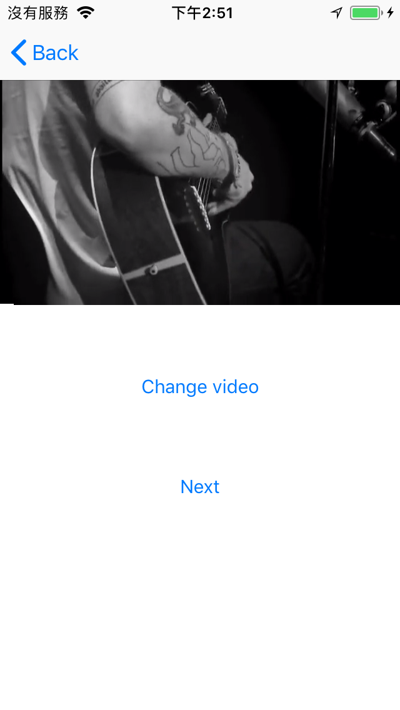
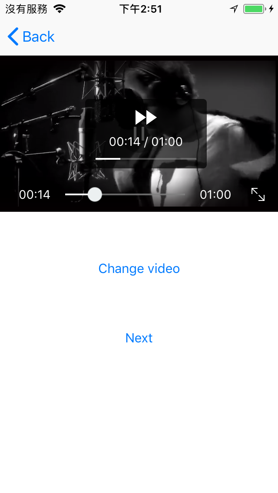
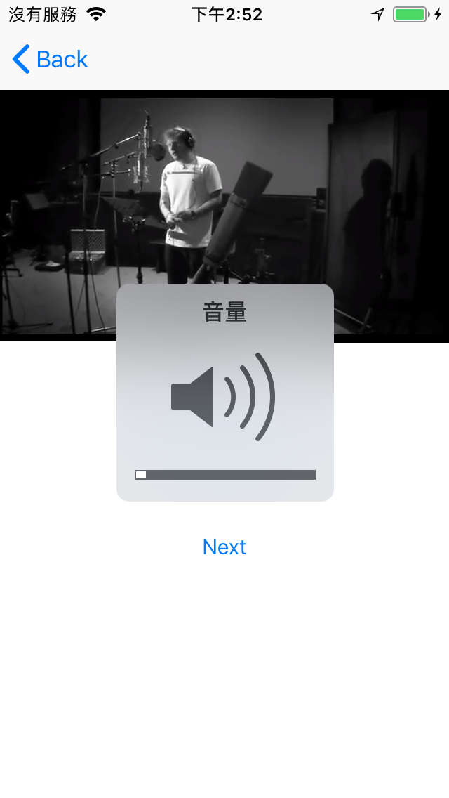
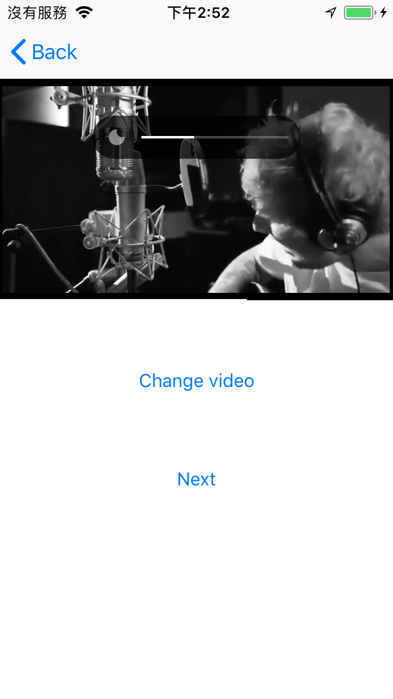
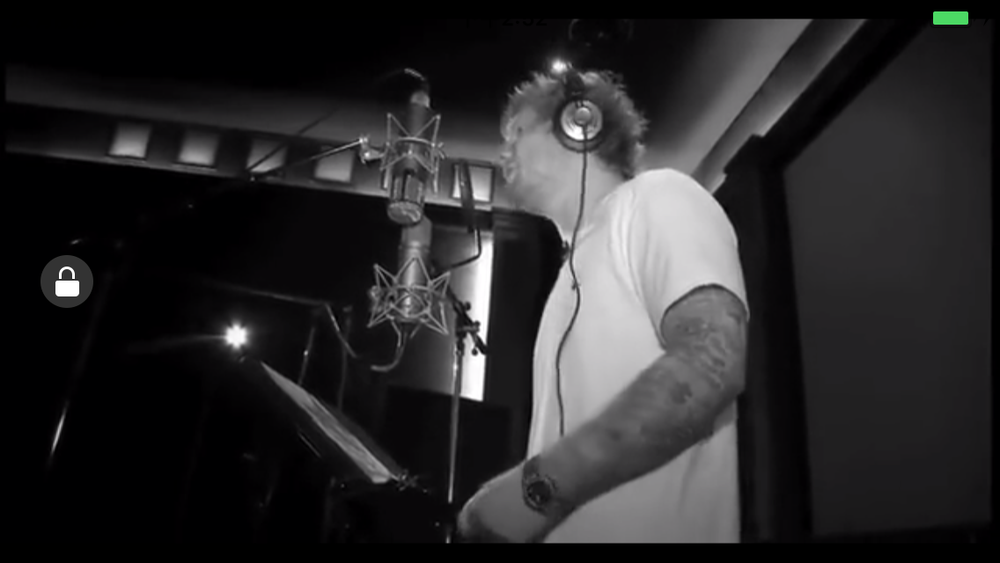

# IRPlayerUIShell 

- IRPlayerUIShell is a powerful UI Shell framework for the video player([IRPlayer](https://github.com/irons163/IRPlayer)) for iOS.

## Features
- Support customize UI for [IRPlayer](https://github.com/irons163/IRPlayer).
- Support some media controllers.
    - Seek Bar
    - Brightness
    - Volume
    - Full Screen
- Support iOS14.
- Has a Demo

## Future
- Support Multi video player in one page(UITableView, UICollectionView, etc).
- More powerful custom UI design.

## Install
### Git
- Git clone this project.
- Copy this project into your own project.
- Add the .xcodeproj into you  project and link it as embed framework.
#### Options
- You can remove the `demo` and `ScreenShots` folder.

### Cocoapods
- Add `pod 'IRPlayerUIShell'`  in the `Podfile`
- `pod install`

## Usage

### Basic
- See `IRPlayerUIShellViewController` for demo.

- Import framework
```obj-c
#import <IRPlayerUIShell/IRPlayerUIShell.h>
```

- Create a [IRPlayer](https://github.com/irons163/IRPlayer) instance.
```obj-c
self.playerImp = [IRPlayerImp player];
self.playerImp.decoder = [IRPlayerDecoder FFmpegDecoder];
[self.playerImp replaceVideoWithURL:VIDEO_URL];
```

- Create a IRPlayerController instance, set the player and containerView while init, and then set the controlView.
```obj-c
self.player = [IRPlayerController playerWithPlayerManager:self.playerImp containerView:self.containerView];
self.player.controlView = self.controlView;
```

- Set the video urls, and then the first video will play!
```obj-c
self.player.assetURLs = self.assetURLs;
```

### Advanced settings
- If app is in the background, still play continue.
```obj-c
self.player.pauseWhenAppResignActive = NO;
```

- Listener for orientation change.
```obj-c
@weakify(self)
self.player.orientationWillChange = ^(IRPlayerController * _Nonnull player, BOOL isFullScreen) {
    @strongify(self)
    [self setNeedsStatusBarAppearanceUpdate];
};
```

- Listener for player go end.
```obj-c
    self.player.playerDidToEnd = ^(id  _Nonnull asset) {
        @strongify(self)
        [self.player.currentPlayerManager pause];
        [self.player.currentPlayerManager play];
        
        [self.player playTheNext];
        if (!self.player.isLastAssetURL) {
        NSString *title = [NSString stringWithFormat:@"title:%zd",self.player.currentPlayIndex];
            [self.controlView showTitle:title coverURLString:kVideoCover fullScreenMode:IRFullScreenModeLandscape];
        } else {
            [self.player stop];
        }
    };
```

- More, coming soon...


## Screenshots
|Play|Seek|
|:---:|:---:|
|||
|Volume|Brightness|
|||
|Full Screen|Lock Screen|
|||


## Copyright
##### This project is inspired from [ZFPlayer](https://github.com/renzifeng/ZFPlayer).
